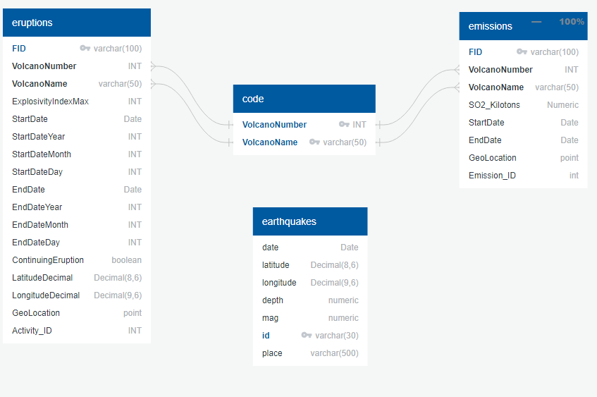

# Earthquake Visualization Tool
---
## Description
The purpose of this project is to develop a tool that is designed to visually identify Earthquakes hazard locations, or coordinates, based on a specific Latitude and Longitude within a specific radius area. Part of this tools is to also, observe volcano eruptions and their emission events that occur worldwide for specific geolocation.


## Instructions
---
1) To run this code, ensure that all the above libraries are installed in your environment.
2) Sign up for [Mapbox API key](https://docs.mapbox.com/api/).
3) Enter your PostgreSQL info in config.py
```python
UserName = "YOUR POSTGRESQL USERNAME"
Password = "YOUR POSTGRESQL PASSWORD"
DataBase = "YOUR POSTGRESQL DATABASE NAME"  
```

4) Run the Flask server by running the ```app.py``` file.
5) Run the IP address created by the Flask server which should look like http://127.0.0.1:5000/ or similar. This renders the ```index.html``` file homepage which can be used to navigate through the visualizations.
---
## File Description
### application.py
This file contains the Python code necessary to create a Flask development server to deploy the visualizations created using Javascript libraries.
### static
This folder contains all the Javascript code used to create the visualizations displayed through the HTML files.
### templates
This folder contains all the HTML code used to display all the visualizations generated by using the Javascript code and libraries.

---

## Deployed website
[Link](http://evt-env.eba-immpf3r3.us-east-2.elasticbeanstalk.com/) the website deployed through AWS
 
---

## Tools Used
- **Numpy**
- **Pandas**
- **Flask**
- **Flask_SQLAlchemy**
- **Jupyter Notebook**
- **Python**
- **SQLAlchemy_utils**
- **HTML**
- **SQLAlchemy**
- **PostgreSQL**
- **Psycopg2**
- **Amazon Web Services**
- **D3.js**
- **Plotly.js**
- **Leaflet.js**


